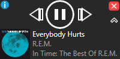

You must have Spotify installed and running to use this software.

Blotify is a mini player for Spotify - you can play/pause songs, as well as skip ahead or back in the playlist - from a tiny window rather than the big Spotify one.

